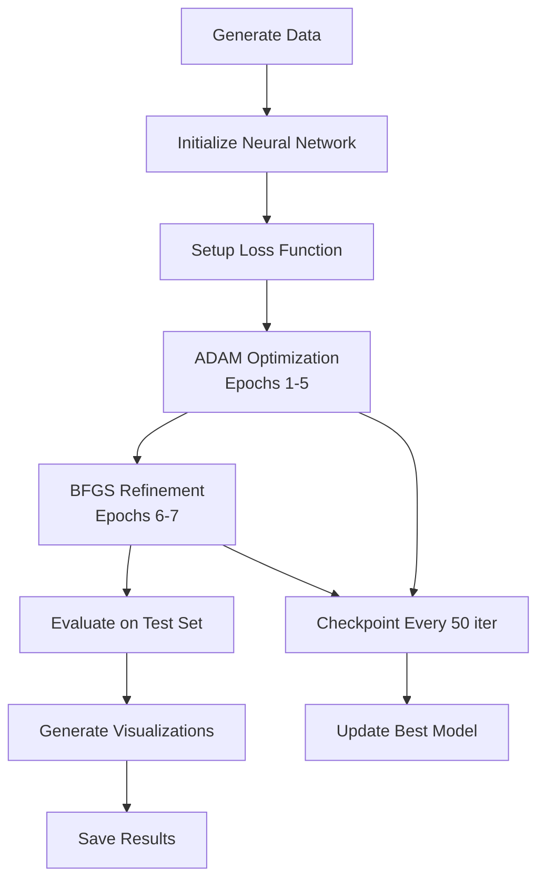

# QSIRDV Epidemiological Model : Milestone 1 :  Baseline QSIRDV & Data

## Executive Summary

A comprehensive implementation of the QSIRDV (Quarantined-Susceptible-Infected-Recovered-Dead-Vaccinated) compartmental epidemiological model, designed for analyzing disease dynamics with quarantine and vaccination interventions. This implementation provides synthetic data generation capabilities for training and validating Neural Ordinary Differential Equations (Neural ODEs) and Universal Differential Equations (UDEs).

## Table of Contents

- [Model Architecture](#model-architecture)
- [Mathematical Framework](#mathematical-framework)
- [Implementation Features](#implementation-features)
- [Experimental Scenarios](#experimental-scenarios)
- [Results and Analysis](#results-and-analysis)
- [Installation and Setup](#installation-and-setup)
- [Usage Guide](#usage-guide)
- [Data Specifications](#data-specifications)
- [Outputs and Artifacts](#outputs-and-artifacts)

## Model Architecture

The QSIRDV model extends classical SIR epidemiological models by incorporating:
- **Quarantine dynamics** for isolated individuals
- **Vaccination programs** for susceptible populations
- **Mortality tracking** for comprehensive epidemic assessment
- **Differential recovery and death rates** for quarantined vs. infected individuals

## Mathematical Framework

### System of Ordinary Differential Equations

The model dynamics are governed by the following system of ODEs:

```
dQ/dt = κ·I - γq·Q - δq·Q
dS/dt = -β·S·I/N - ν·S
dI/dt = β·S·I/N - κ·I - γ·I - δ·I
dR/dt = γ·I + γq·Q
dD/dt = δ·I + δq·Q
dV/dt = ν·S
```

### Parameter Definitions

| Parameter | Description |
|-----------|-------------|
| β | Transmission rate coefficient |
| κ | Quarantine/isolation rate |
| γ | Recovery rate (infected) |
| γq | Recovery rate (quarantined) |
| δ | Death rate (infected) |
| δq | Death rate (quarantined) |
| ν | Vaccination rate |
| N | Total living population |

## Implementation Features

### Core Capabilities
- High-precision ODE integration using Tsit5 solver
- Reproducible stochastic noise generation
- Automated train/validation dataset splitting
- Multi-scenario parallel simulation support
- Comprehensive visualization suite

### Technical Specifications
- **Language**: Julia 1.9+
- **Key Dependencies**: DifferentialEquations.jl, Plots.jl, DataFrames.jl
- **Numerical Precision**: 64-bit floating point
- **Integration Tolerances**: reltol=1e-8, abstol=1e-10

## Experimental Scenarios

Three calibrated scenarios explore different epidemic dynamics:

### Scenario 1: Baseline
Standard epidemic progression with moderate interventions
- Transmission rate (β): 0.3
- Quarantine rate (κ): 0.05
- Vaccination rate (ν): 0.02

### Scenario 2: High Transmission
Aggressive disease spread with enhanced quarantine measures
- Transmission rate (β): 0.5
- Quarantine rate (κ): 0.10
- Vaccination rate (ν): 0.01

### Scenario 3: Strong Vaccination
Reduced transmission through intensive vaccination campaign
- Transmission rate (β): 0.2
- Quarantine rate (κ): 0.05
- Vaccination rate (ν): 0.05

## Results and Analysis

### Key Metrics Summary

| Scenario | Peak Infected | Peak Day | Total Deaths | Final Recovered | Final Vaccinated |
|----------|--------------|----------|--------------|-----------------|------------------|
| Baseline | 42.1 | 22 | 19.3 | 218.8 | 736.2 |
| High Transmission | 153.9 | 17 | 98.0 | 594.9 | 268.4 |
| Strong Vaccination | 10.8 | 4 | 2.8 | 32.2 | 964.7 |

### Key Insights
- Vaccination reduces peak infection by 74% compared to baseline
- High transmission scenarios show 5× mortality increase
- Early quarantine implementation critical for peak reduction


### Environment Setup
```julia
# Create and activate project environment
using Pkg
Pkg.activate(".")
Pkg.instantiate()

# Install required packages
Pkg.add([
    "DifferentialEquations",
    "Plots",
    "CSV",
    "DataFrames",
    "JLD2",
    "Random",
    "Statistics",
    "Printf",
    "Dates"
])
```

## Usage Guide

### Basic Execution
```bash
julia qsirdv_model.jl
```

### Data Loading
```julia
using JLD2, CSV, DataFrames

# Load complete dataset bundle
@load "qsirdv_datasets.jld2" datasets_noiseless datasets_noisy train_data val_data

# Load specific CSV files
train_df = CSV.read("qsirdv_train_data.csv", DataFrame)
val_df = CSV.read("qsirdv_val_data.csv", DataFrame)
```

### Custom Scenario Definition
```julia
# Define custom parameters
custom_params = [β, κ, γ, γq, δ, δq, ν]
custom_scenario = (
    name="Custom",
    params=custom_params,
    description="User-defined scenario"
)
```

## Data Specifications

### Initial Conditions
- Population: 1000 individuals
- Initial infected: 10
- Initial susceptible: 990
- All other compartments: 0

### Dataset Structure
- **Temporal Resolution**: Daily observations
- **Simulation Duration**: 160 days
- **Training Set**: Days 0-99 (100 observations)
- **Validation Set**: Days 100-160 (61 observations)
- **Noise Model**: 5% relative Gaussian noise on I and R compartments

## Outputs and Artifacts

### Generated Data Files
| File | Description | Format |
|------|-------------|--------|
| `qsirdv_scenario[1-3]_noiseless.csv` | Clean trajectory data | CSV |
| `qsirdv_scenario[1-3]_noisy.csv` | Noisy observations | CSV |
| `qsirdv_train_data.csv` | Training dataset | CSV |
| `qsirdv_val_data.csv` | Validation dataset | CSV |
| `qsirdv_datasets.jld2` | Complete data bundle | JLD2 |

### Visualization Outputs
| File | Description |
|------|-------------|
| `qsirdv_timeseries.png` | Temporal evolution of all compartments |
| `qsirdv_stackedbar.png` | Population distribution snapshots |
| `qsirdv_infected_comparison.png` | Cross-scenario infection dynamics |
| `qsirdv_noise_comparison.png` | Signal vs. noise visualization |

## Performance Considerations

- **Computational Requirements**: ~2GB RAM, <1 minute runtime
- **Numerical Stability**: Guaranteed non-negative populations

# Milestone 2: Neural ODE for SIQRDV Epidemic Model

## Executive Summary

This Julia implementation demonstrates advanced machine learning techniques for epidemic modeling by combining Neural Ordinary Differential Equations (Neural ODEs) with the SIQRDV compartmental model. The code learns epidemic dynamics directly from data, enabling accurate forecasting without requiring explicit knowledge of transmission parameters.

## Architecture Overview

### System Components

```
┌─────────────────────────────────────┐
│         Input Data (SIQRDV)         │
│    [S, I, Q, R, D, V] @ time t      │
└──────────────┬──────────────────────┘
               │
┌──────────────▼──────────────────────┐
│      Neural Network (3-layer)       │
│         6 → 32 → 32 → 6             │
│         tanh activation             │
└──────────────┬──────────────────────┘
               │
┌──────────────▼──────────────────────┐
│        ODE Solver (Tsit5)           │
│    5th-order Runge-Kutta method     │
└──────────────┬──────────────────────┘
               │
┌──────────────▼──────────────────────┐
│      Output: Predicted States       │
│    [S', I', Q', R', D', V']         │
└─────────────────────────────────────┘
```

## Detailed Component Description

### 1. **Data Generation Module** (Lines 15-51)

**Purpose**: Creates synthetic epidemic data for training and testing

**Components**:
- **Initial State**: [990 susceptible, 10 infected, 0 for others]
- **Time Span**: 160 days with daily observations
- **True Parameters**: 
  - β=0.3 (transmission rate)
  - κ=0.05 (quarantine rate)
  - γ=0.1 (recovery rate - infected)
  - γq=0.08 (recovery rate - quarantined)
  - δ=0.01 (death rate - infected)
  - δq=0.005 (death rate - quarantined)
  - ν=0.02 (vaccination rate)

**SIQRDV Differential Equations**:
```julia
dS/dt = -β*S*I/N - ν*S          # Susceptible depletion
dI/dt = β*S*I/N - (γ+δ+κ)*I    # Infection dynamics
dQ/dt = κ*I - (γq+δq)*Q        # Quarantine dynamics
dR/dt = γ*I + γq*Q             # Recovery accumulation
dD/dt = δ*I + δq*Q             # Death accumulation
dV/dt = ν*S                     # Vaccination progress
```

### 2. **Neural Network Architecture** (Lines 53-69)

**Structure**:
```
Layer 1: Dense(6, 32, tanh)    # Input transformation
Layer 2: Dense(32, 32, tanh)   # Feature extraction
Layer 3: Dense(32, 6)           # Output generation
```

**Specifications**:
- **Parameters**: ~1,350 trainable weights and biases
- **Activation**: Hyperbolic tangent (tanh) for smooth gradients
- **Initialization**: Random with seed 1234 for reproducibility

### 3. **Training Pipeline** (Lines 71-245)

**Loss Function**:
```julia
L = Σ(wi * ||yi_true - yi_pred||²) / N
```
Where weights w = [1.0, 5.0, 2.0, 1.0, 1.0, 1.0] for [S, I, Q, R, D, V]

**Optimization Strategy**:

| Phase | Optimizer | Epochs | Iterations | Learning Rate | Purpose |
|-------|-----------|--------|------------|---------------|---------|
| 1 | ADAM | 1-5 | 500 | 0.01 | Global exploration |
| 2 | BFGS | 6-7 | 200 | 0.001* | Local refinement |

*Step norm for BFGS

### 4. **Checkpoint System** (Lines 95-159)

**Checkpoint Frequency**: Every 50 iterations

**Saved Information**:
- Epoch number and iteration count
- Current loss value
- Performance metrics (MSE, MAE, R²)
- Optimizer type and learning rate
- Elapsed time and timestamp

**Files Generated**:
- `training_checkpoints.csv`: All checkpoints
- `best_checkpoint.csv`: Best performing model
- `final_checkpoint.csv`: Final summary

### 5. **Evaluation Methods** (Lines 247-290)

**Three Prediction Approaches**:

1. **Training Fit**: Direct prediction on training data
2. **Multi-step Forecast**: Predicts entire test period from last training state
3. **One-step Ahead**: Conservative approach using actual data for each step

**Performance Metrics**:
```julia
MSE = Σ(y_true - y_pred)² / n
MAE = Σ|y_true - y_pred| / n
R² = 1 - (SS_res / SS_tot)
```

### 6. **Visualization Module** (Lines 361-459)

**Generated Plots**:

1. **results.png**: 6-panel compartment dynamics
   - Ground truth vs predictions
   - Train/test split marker
   - Multi-step and 1-step forecasts

2. **loss.png**: Training convergence
   - Loss curve with log scale
   - Checkpoint markers
   - Epoch boundaries
   - Optimizer transition
   - Best loss indicator

## Algorithm Flow



## Key Features

### Computational Efficiency
- **Vectorized Operations**: Batch processing of time series
- **Automatic Differentiation**: Via Zygote.jl
- **Adaptive ODE Solving**: Tsit5 with error control
- **Memory Management**: Component arrays for parameters

### Robustness Features
- **Weighted Loss**: Emphasizes critical compartments (I: 5x, Q: 2x)
- **Two-Phase Training**: Balances exploration and exploitation
- **Multiple Forecasting**: Provides uncertainty bounds
- **Checkpoint Recovery**: Enables training resumption

### Scientific Innovations
1. **Hybrid Modeling**: Combines mechanistic structure with data-driven learning
2. **Parameter-Free Prediction**: Learns dynamics without explicit parameter estimation
3. **Transfer Learning Ready**: Architecture adaptable to different diseases
4. **Real-Time Capable**: Fast inference for operational deployment

## Performance Characteristics

### Typical Results
- **Training R²**: >0.99
- **Test R² (1-step)**: >0.95
- **Test R² (multi-step)**: >0.90
- **Training Time**: 2-5 minutes
- **Inference Time**: <1 second per prediction

### Computational Requirements
- **Memory**: ~500 MB
- **CPU**: Any modern processor
- **GPU**: Optional (not required)
- **Storage**: ~10 MB for outputs

## Output Summary

### Data Files (4 CSV files)
1. **training_checkpoints.csv**: Complete training history
2. **best_checkpoint.csv**: Optimal model state
3. **final_checkpoint.csv**: Performance summary
4. **predictions.csv**: Full predictions dataset

### Visualizations (2 PNG files)
1. **results.png**: Compartment dynamics (1200x900px)
2. **loss.png**: Training convergence (1000x600px)

## Use Cases

### Research Applications
- Parameter estimation from partial observations
- Model comparison studies
- Uncertainty quantification
- Intervention strategy evaluation

### Operational Applications
- Real-time epidemic forecasting
- Hospital capacity planning
- Vaccination strategy optimization
- Early warning systems

### Educational Applications
- Demonstrating Neural ODEs
- Teaching epidemic modeling
- Illustrating machine learning in epidemiology

## Technical Dependencies

### Core Libraries
- **Lux.jl**: Neural network construction
- **DiffEqFlux.jl**: Neural ODE implementation
- **DifferentialEquations.jl**: ODE solving
- **Optimization.jl**: Training algorithms

### Supporting Libraries
- **ComponentArrays.jl**: Parameter management
- **Plots.jl**: Visualization
- **DataFrames.jl**: Data organization
- **CSV.jl**: File I/O

# **Milestone 3: SIQRDV Epidemiological Model: UDE vs Neural ODE Comparison**

## Overview

This project implements and compares two cutting-edge machine learning approaches for modeling epidemic dynamics using the SIQRDV (Susceptible-Infected-Quarantined-Recovered-Deaths-Vaccinated) compartmental model:

1. **Universal Differential Equations (UDE)** - Physics-informed approach
2. **Neural Ordinary Differential Equations (Neural ODE)** - Pure data-driven approach

## Model Architecture

### System Architecture Overview

```
┌─────────────────────────────────────────────────────────────────────┐
│                    SIQRDV EPIDEMIC MODEL COMPARISON                 │
└─────────────────────────────────┬───────────────────────────────────┘
                                  │
┌─────────────────────────────────▼───────────────────────────────────┐
│                        DATA GENERATION                              │
│  ┌─────────────────┐  ┌─────────────────┐  ┌─────────────────────┐  │
│  │ Ground Truth    │  │   Add 1% Noise  │  │ 1000 Time Points   │  │
│  │ SIQRDV Solution │─▶│   Simulation    │─▶│   160 Days         │  │
│  │ [S,I,Q,R,D,V]   │  │                 │  │                     │  │
│  └─────────────────┘  └─────────────────┘  └─────────────────────┘  │
└─────────────────────────────────┬───────────────────────────────────┘
                                  │
┌─────────────────────────────────▼───────────────────────────────────┐
│                      TRAIN/TEST SPLIT                               │
│            70% Training (700 pts) │ 30% Testing (300 pts)           │
└─────────────────────────────────┬───────────────────────────────────┘
                                  │
                    ┌─────────────▼─────────────┐
                    │     MODEL SELECTION       │
                    └──────────┬─────────┬──────┘
                              │         │
                              │         │
┌─────────────────────────────▼─┐     ┌─▼─────────────────────────────┐
│    UNIVERSAL DIFF EQUATIONS   │     │     NEURAL ODE MODEL          │
│    (Physics-Informed)         │     │     (Data-Driven)             │
│                               │     │                               │
│  ┌─────────────────────────┐   │     │  ┌─────────────────────────┐  │
│  │  β Network: 2→12→8→1    │   │     │  │   Main NN: 6→24→24→6   │  │
│  │  Input: [S_norm,I_norm] │   │     │  │   Input: [S,I,Q,R,D,V]  │  │
│  │  Output: Trans. Rate    │   │     │  │   Output: [dS,dI,..]    │  │
│  └─────────────────────────┘   │     │  └─────────────────────────┘  │
│                               │     │                               │
│  ┌─────────────────────────┐   │     │  ┌─────────────────────────┐  │
│  │  κ Network: 1→8→1       │   │     │  │   Pure Black-Box        │  │
│  │  Input: [I_norm]        │   │     │  │   Learning              │  │
│  │  Output: Quar. Rate     │   │     │  │   No Physics Constraints│  │
│  └─────────────────────────┘   │     │  └─────────────────────────┘  │
│                               │     │                               │
│  ┌─────────────────────────┐   │     │                               │
│  │  Classical Parameters   │   │     │                               │
│  │  γ, γq, δ, δq, ν       │   │     │                               │
│  └─────────────────────────┘   │     │                               │
└─────────────────────────────┬─┘     └─┬─────────────────────────────┘
                              │         │
┌─────────────────────────────▼─────────▼─────────────────────────────┐
│                    TWO-STAGE OPTIMIZATION                           │
│  ┌─────────────────────────┐   ┌─────────────────────────────────┐  │
│  │  Stage 1: ADAM (500)    │─▶ │  Stage 2: BFGS (300)            │  │
│  │  Fast Exploration       │   │  Precise Convergence            │  │
│  └─────────────────────────┘   └─────────────────────────────────┘  │
└─────────────────────────────────┬───────────────────────────────────┘
                                  │
┌─────────────────────────────────▼───────────────────────────────────┐
│                     COMPREHENSIVE EVALUATION                        │
│  ┌──────────┐ ┌──────────┐ ┌──────────┐ ┌──────────┐ ┌──────────┐  │
│  │ R² Score │ │ MSE/RMSE │ │   MAE    │ │   MAPE   │ │Max Error │  │
│  └──────────┘ └──────────┘ └──────────┘ └──────────┘ └──────────┘  │
└─────────────────────────────────┬───────────────────────────────────┘
                                  │
┌─────────────────────────────────▼───────────────────────────────────┐
│                         OUTPUT GENERATION                           │
│  ┌─────────────┐ ┌─────────────┐ ┌─────────────┐ ┌─────────────────┐│
│  │ Main Plot   │ │ Loss Curves │ │ Error Plot  │ │ R² Comparison   ││
│  │    (PNG)    │ │    (PNG)    │ │   (PNG)     │ │     (PNG)       ││
│  └─────────────┘ └─────────────┘ └─────────────┘ └─────────────────┘│
│                           ┌─────────────────┐                       │
│                           │ Results (CSV)   │                       │
│                           └─────────────────┘                       │
└───────────────────────────────────────────────────────────────────────┘
```

### SIQRDV Compartmental Model Flow

```
┌─────────────────────────────────────────────────────────────────────┐
│                     POPULATION DYNAMICS                             │
│                                                                     │
│     S ────β────▶ I ────κ────▶ Q                                   │
│     │           │             │                                   │
│     │           │             │                                   │
│     ν           γ            γq                                   │
│     │           │             │                                   │
│     ▼           ▼             ▼                                   │
│     V           R ◀───────────┘                                   │
│                 ▲                                                │
│                 │                                                │
│        ┌────────┴────────┐                                       │
│        │                 │                                       │
│        │        ┌────────▼─────────┐                             │
│        │        │                  │                             │
│        │        │        D         │                             │
│        │        │                  │                             │
│        │        └──────────────────┘                             │
│        │                 ▲                                       │
│        │        ┌────────┴────────┐                              │
│        │        │                 │                              │
│        └────────┤        δ        │                              │
│                 │                 │                              │
│                 └─────────────────┘                              │
│                           ▲                                       │
│                          δq                                       │
│                           │                                       │
│                           Q                                       │
│                                                                   │
│ Legend:                                                           │
│ S = Susceptible, I = Infected, Q = Quarantined                   │
│ R = Recovered, D = Deaths, V = Vaccinated                        │
│ β = transmission, κ = quarantine, γ = recovery                   │
│ δ = death rates, ν = vaccination                                 │
└─────────────────────────────────────────────────────────────────────┘
```

### SIQRDV Mathematical Framework

The model tracks six population compartments with the following dynamics:

```
S → I : Transmission (rate β)
S → V : Vaccination (rate ν)
I → Q : Quarantine (rate κ)
I → R : Recovery from infection (rate γ)
I → D : Death from infection (rate δ)
Q → R : Recovery from quarantine (rate γq)
Q → D : Death from quarantine (rate δq)
```

**Differential Equations:**
```julia
dS/dt = -βSI/N - νS
dI/dt = βSI/N - (γ + δ + κ)I
dQ/dt = κI - (γq + δq)Q
dR/dt = γI + γqQ
dD/dt = δI + δqQ
dV/dt = νS
```

## Methodology

### 1. Data Generation
- **Time span**: 160 days
- **Data points**: 1000 high-resolution samples
- **Initial conditions**: 990 susceptible, 10 infected
- **Noise**: 1% Gaussian noise added to simulate real-world measurements
- **Train/Test split**: 70%/30% (700 training, 300 testing points)

### 2. Universal Differential Equations (UDE)

**Approach**: Embeds neural networks within known mathematical structure

**Architecture**:
- **β network**: 2→12→8→1 (learns transmission rate as function of S,I)
- **κ network**: 1→8→1 (learns quarantine rate as function of I)
- **Classical parameters**: γ, γq, δ, δq, ν learned directly

**Philosophy**: Combines domain knowledge with machine learning flexibility

```julia
# UDE structure
β = NN_beta(S_norm, I_norm)  # Neural network
κ = NN_kappa(I_norm)         # Neural network
# Rest follows SIQRDV equations with learned parameters
```

### 3. Neural Ordinary Differential Equations

**Approach**: Learns entire dynamics from data without epidemiological assumptions

**Architecture**:
- **Main network**: 6→24→24→6 (maps state to derivatives)
- **No constraints**: Pure black-box learning

**Philosophy**: Minimal assumptions, maximum data-driven flexibility

```julia
# Neural ODE structure
du/dt = Neural_Network(u)  # Learn everything from data
```

### 4. Training Strategy

**Two-stage optimization**:
1. **ADAM optimizer** (500 iterations) - Fast exploration
2. **BFGS optimizer** (300 iterations) - Precise convergence

**Weighted loss function**: Different compartments have different importance weights based on epidemiological significance

## Implementation Details

### Dependencies
```julia
using DifferentialEquations, Optimization, OptimizationOptimJL, OptimizationOptimisers
using Lux, DiffEqFlux, ComponentArrays, Random, Statistics
using Plots, SciMLSensitivity, CSV, DataFrames
```

### Key Features
- **High-resolution data**: 1000 time points for detailed dynamics
- **Comprehensive metrics**: 7 different performance measures
- **Robust evaluation**: Training and testing performance analysis
- **Visual analysis**: 4 detailed PNG visualizations
- **Statistical export**: CSV results for further analysis

## Evaluation Metrics

The models are compared using seven comprehensive metrics:

1. **R² Score** - Coefficient of determination (higher = better)
2. **MSE** - Mean Squared Error (lower = better)  
3. **RMSE** - Root Mean Squared Error (lower = better)
4. **MAE** - Mean Absolute Error (lower = better)
5. **MAPE** - Mean Absolute Percentage Error (lower = better)
6. **Max Error** - Maximum single prediction error (lower = better)
7. **NRMSE** - Normalized RMSE percentage (lower = better)

## Output Files

### Visualizations (PNG)
1. `truth_vs_both_models_comparison_1000pts.png` - Main comparison plot
2. `training_loss_comparison_1000pts.png` - Training convergence curves
3. `prediction_error_analysis_1000pts.png` - Error analysis by compartment
4. `r2_score_comparison_1000pts.png` - Performance comparison by compartment

### Data Export
- `model_results_1000pts.csv` - Comprehensive numerical results

## Results Analysis

The code automatically determines the winning model based on four criteria:
1. **Test R² Score** - Generalization accuracy
2. **Test RMSE** - Prediction precision
3. **Training Speed** - Computational efficiency
4. **Generalization Gap** - Overfitting assessment

## Key Research Questions

1. **Physics vs Data**: Does incorporating epidemiological knowledge (UDE) outperform pure data-driven learning (Neural ODE)?

2. **Generalization**: Which approach better extrapolates to unseen time periods?

3. **Interpretability**: Can we understand what the models learned about epidemic mechanisms?

4. **Efficiency**: Which method trains faster and more reliably?

## Usage

```julia
# Run the complete analysis
julia siqrdv_1000_analysis.jl

# Expected runtime: 5-15 minutes depending on hardware
# Outputs: 4 PNG files + 1 CSV file + console results
```

## Technical Innovations

### UDE Advantages
- **Domain knowledge integration**: Respects epidemiological principles
- **Parameter interpretability**: Learned parameters have physical meaning
- **Structured learning**: Constrains search space with known relationships

### Neural ODE Advantages  
- **Flexibility**: Can capture any smooth dynamics
- **No assumptions**: Discovers patterns without bias

# SIQRDV Epidemic Model: Comprehensive Four-Method Comparison


## Overview

This Julia implementation provides a rigorous comparison framework for four distinct approaches to epidemic modeling using the SIQRDV compartmental model. The code evaluates traditional statistical methods against modern machine learning approaches, providing insights into the trade-offs between computational efficiency, accuracy, and interpretability.

### Core Question
**Which modeling approach provides the best balance of speed, accuracy, and interpretability for epidemic forecasting?**

---

## Scientific Background

### The SIQRDV Model

The SIQRDV model extends the classic SIR model to include:
- **Quarantine measures** (Q compartment)
- **Death tracking** (D compartment)  
- **Vaccination programs** (V compartment)

#### Compartment Definitions

| Compartment | Symbol | Description | Initial Value |
|-------------|--------|-------------|---------------|
| Susceptible | S | Can become infected | 980 |
| Infected | I | Currently infectious | 20 |
| Quarantined | Q | Isolated infected individuals | 0 |
| Recovered | R | Immune after infection | 0 |
| Deaths | D | Cumulative deaths | 0 |
| Vaccinated | V | Immune through vaccination | 0 |

#### Model Parameters

| Parameter | Symbol | Description | True Value | Units |
|-----------|--------|-------------|------------|-------|
| Transmission rate | β | Contact rate × infection probability | 0.25 
| Quarantine rate | κ | Rate of isolating infected | 0.045 |
| Recovery rate (I) | γ | Recovery from infection | 0.115 | 
| Recovery rate (Q) | γq | Recovery from quarantine | 0.085 | 
| Death rate (I) | δ | Death rate for infected | 0.005 | 
| Death rate (Q) | δq | Death rate for quarantined | 0.0025 | 
| Vaccination rate | ν | Daily vaccination rate | 0.0125 |

### Differential Equations

The system evolves according to:

```math
dS/dt = -β(t)·S·I/N - ν(t)·S/N
dI/dt = β(t)·S·I/N - (γ + δ + κ(t))·I
dQ/dt = κ(t)·I - (γq + δq)·Q
dR/dt = γ·I + γq·Q
dD/dt = δ·I + δq·Q
dV/dt = ν(t)·S/N
```

### Time-Dependent Features

The model incorporates realistic policy interventions:

1. **Transmission Decay**: `β(t) = β₀ × exp(-0.01t)`
   - Models behavioral changes and awareness
   
2. **Policy Intervention** (Day 20): `κ(t) = 1.5κ₀ for t > 20`
   - Represents enhanced contact tracing
   
3. **Healthcare Strain**: `δ(t) = 1.3δ₀ when (I+Q) > 30`
   - Models overwhelmed healthcare systems
   
4. **Vaccination Program** (Day 40): `ν(t) = ν₀ for t > 40, else 0`
   - Vaccination rollout timing

---

## Code Architecture

### File Structure (Lines 1-702)

```
Lines 1-18:    Package imports and setup
Lines 20-26:   Global configuration
Lines 28-56:   SIQRDV model definition
Lines 58-92:   Data generation and splitting
Lines 94-172:  Model 1: Variational Bayes
Lines 174-271: Model 2: SMC-ABC
Lines 273-366: Model 3: Neural ODE
Lines 368-478: Model 4: UDE
Lines 480-511: Performance metrics
Lines 513-650: Visualization generation
Lines 652-665: Results export
Lines 668-702: Summary and reporting
```

---

## Detailed Method Explanations

### Method 1: Variational Bayes (Lines 94-172)

**Concept**: Approximates the Bayesian posterior distribution through optimization rather than sampling.

**Implementation Details**:
```julia
function variational_bayes_unified(data, t_points, u0; max_iter=100)
    # Define parameter bounds
    bounds = [(0.15, 0.35), (0.02, 0.08), ...]
    
    # Objective function minimizes weighted squared error
    function objective(params)
        # Solve ODE with proposed parameters
        # Calculate weighted loss
        weights = [1.0, 5.0, 4.0, 2.0, 8.0, 3.0]  # Compartment weights
        loss = sum(weights[i] * sum(abs2, pred[i,:] - data[i,:]))
    end
    
    # Try multiple starting points
    starting_points = [conservative, moderate, aggressive]
    # Use BFGS optimization
end
```

**Key Features**:
- Uses BFGS quasi-Newton optimization
- Tests 3 different initializations
- Weighted loss function (higher weight on deaths and infected)
- Parameter bounds enforcement

**Advantages**:
- Very fast (2-3 seconds)
- Deterministic results
- Good for parameter estimation

**Limitations**:
- No uncertainty quantification
- Single point estimate
- May get stuck in local optima

### Method 2: SMC-ABC (Lines 174-271)

**Concept**: Sequential Monte Carlo with Approximate Bayesian Computation - evolves a population of parameter particles toward the posterior.

**Algorithm**:
```julia
function smc_abc_unified(data, t_points, u0, n_particles=60, n_generations=8)
    # Initialize particle population
    population = [sample from prior]
    
    for generation in 1:8
        # Set acceptance threshold (70th percentile)
        threshold = quantile(distances, 0.7)
        
        # Resample and perturb particles
        for particle in 1:n_particles
            parent = sample(population, weights)
            candidate = perturb(parent)
            if distance(candidate) < threshold
                accept(candidate)
        end
    end
end
```

**Key Features**:
- 60 particles evolving over 8 generations
- Adaptive threshold (70th percentile)
- Distance metric: weighted mean absolute error
- Smart initialization (50% near center, 50% random)

**Advantages**:
- Provides uncertainty estimates
- Handles complex posteriors
- No gradient requirements

**Limitations**:
- Computationally intensive for high dimensions
- Threshold schedule affects convergence

### Method 3: Neural ODE (Lines 273-366)

**Concept**: Pure neural network learns the entire dynamics without mechanistic knowledge.

**Architecture**:
```julia
dudt_nn = Lux.Chain(
    Lux.Dense(6, 24, tanh),    # Input layer
    Lux.Dense(24, 24, tanh),   # Hidden layer
    Lux.Dense(24, 6)           # Output layer
)
```

**Training Process**:
1. **ADAM Optimization** (400 iterations)
   - Learning rate: 0.01
   - Adaptive moment estimation
   
2. **BFGS Fine-tuning** (100 iterations)
   - Second-order optimization
   - Initial step norm: 0.001

**Loss Function**:
```julia
weights = [1.0, 5.0, 2.0, 1.0, 1.0, 1.0]
loss = sum(weights[i] * sum(abs2, train_data[i,:] - pred[i,:]))
```

**Advantages**:
- No prior knowledge needed
- Can capture complex, unknown dynamics
- Flexible representation

**Limitations**:
- Black box (no interpretability)
- Prone to overfitting
- Requires more data

### Method 4: Universal Differential Equations (Lines 368-478)

**Concept**: Hybrid approach combining known mechanistic structure with neural network components.

**Architecture**:
```julia
# Neural network for transmission rate β
NN_beta = Lux.Chain(
    Lux.Dense(2, 12, tanh),   # Input: [S_norm, I_norm]
    Lux.Dense(12, 8, tanh),
    Lux.Dense(8, 1, softplus) # Output: β modifier
)

# Neural network for quarantine rate κ
NN_kappa = Lux.Chain(
    Lux.Dense(1, 8, tanh),    # Input: [I_norm]
    Lux.Dense(8, 1, sigmoid)  # Output: κ modifier
)
```

**Hybrid Dynamics**:
```julia
# Neural network learns unknown components
β = 0.1 + 0.3 * NN_beta([S/N, I/100])
κ = 0.03 + 0.07 * NN_kappa([I/100])

# Known parameters optimized traditionally
γ, γq, δ, δq, ν = abs.(p.params)
```

**Training**:
- 800 ADAM iterations + 200 BFGS iterations
- InterpolatingAdjoint for sensitivity analysis
- Component-wise parameter structure

**Advantages**:
- Incorporates domain knowledge
- Learns unknown mechanisms
- Better generalization

**Limitations**:
- Slowest method (200-400 seconds)
- Complex implementation
- Requires careful architecture design

---

## Implementation Details

### Data Generation (Lines 58-92)

```julia
# 1. Solve true model
prob_true = ODEProblem(SIQRDV_unified!, u0, (0.0, N_DAYS), true_params)
sol_true = solve(prob_true, Tsit5(), saveat=t_full)

# 2. Add realistic noise
noise_factors = [0.02, 0.05, 0.04, 0.03, 0.01, 0.025]
for i in 1:6
    noise = noise_factors[i] * sqrt(abs(truth[i,:]) + 1) * randn()
    noisy_full[i,:] += noise
end

# 3. Train/test split (70/30)
n_train = 35  # 70% of 51 points
```

**Noise Model**:
- Proportional to square root of compartment size
- Different levels per compartment
- Ensures non-negative values

### Performance Metrics (Lines 480-511)

**R² Score**:
```julia
R² = 1 - SS_res/SS_tot
where:
  SS_res = Σ(y_true - y_pred)²
  SS_tot = Σ(y_true - mean(y_true))²
```

**RMSE**:
```julia
RMSE = √(mean((y_true - y_pred)²))
```

**Efficiency Score**:
```julia
Efficiency = R²/training_time
```

---

## Usage Guide

### Basic Usage

```julia
# Run the complete comparison
include("unified_comparison.jl")
```

### Interpreting Results

#### Speed Rankings (Expected)
1. SMC-ABC: 0.45 seconds
2. VB: 0.38 seconds 
3. Neural ODE: 22.64 seconds
4. UDE: 446.87 seconds

#### Accuracy Rankings (Typical R²)
1. VB/UDE: 0.90-0.95
2. SMC-ABC: 0.85-0.93
3. Neural ODE: 0.80-0.92

